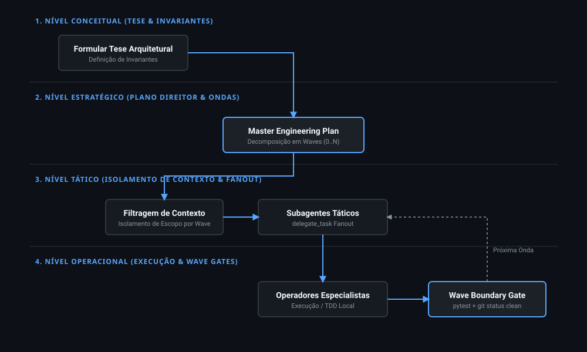

# Quantiflux: Meta-Engineering & Multi-Wave Agent Orchestration

Framework metanalítico de engenharia de software para orquestração de enxames de subagentes autônomos por meio de **Planos Diretores** e **Execução por Ondas (Wave-based Execution)**.



---

## Estrutura do Repositório

```
quantiflux/
├── README.md                           # Documentação principal
├── quantiflux_operation_diagram.bpmn.xml # Diagrama BPMN 2.0 formal
├── assets/
│   └── quantiflux_architecture.svg     # Diagrama vetorial SVG
├── docs/
│   ├── AGENT_HARNESS_GUIDE.md          # Guia de instalação e operação para Agentes
│   └── abntex2/                        # Documentação em TeX/LaTeX (padrão ABNT)
│       ├── main.tex                    # Arquivo principal ABNT
│       ├── capitulo1_introducao.tex
│       ├── capitulo2_arquitetura.tex
│       ├── capitulo3_orquestracao_ondas.tex
│       └── capitulo4_conclusao.tex
└── plugins/
    └── harness/                         # Plugin JS genérico para orquestração
        ├── package.json
        └── index.js
```

---

## Fluxo Metanalítico Integrado (Camadas, Subfluxos, CI/CD e Resíduo)

```
+---------------------------------------------------------------------------------------------------------+
|                                    QUANTIFLUX: METODOLOGIA COMPACTA                                     |
+---------------------------------------------------------------------------------------------------------+

[1. NÍVEL CONCEITUAL] ──► Tese de Arquitetura & Invariantes de Negócio
  └─► Subfluxo: [Mapear Domínio] ──► [Definir Contratos] ──► [Travar Invariantes]

[2. NÍVEL ESTRATÉGICO] ──► Master Engineering Plan (.hermes/plans/) & Decomposição por Ondas
  └─► Subfluxo: [Minerar Resíduo/Commits] ──► [Cherry-Pick de Mudanças Legítimas] ──► [Vincular a Waves]
        │
        └──► Re-alinhar Estratégia via Resíduo (Iteração Dinâmica de Escopo)

[3. NÍVEL TÁTICO] ──► Isolamento de Contexto & Despacho de Subagentes
  └─► Subfluxo: [Filtrar Prompt por Wave] ──► [Montar Task Manifest] ──► [delegate_task Fanout]

[4. NÍVEL OPERACIONAL] ──► Execução Local & CI/CD Wave Gates
  └─► Subfluxo Local: [Escrita de Código / TDD] ──► [Testes Locais] ──► [Verification Gate]
        │
        ▼
[PIPELINE CI/CD & ARTEFATOS]
  ├─► [GitHub Actions Workflow] (LaTeX ABNT Compilation -> main.pdf)
  ├─► [Asset & Diagram Validation] (SVG Architecture & BPMN 2.0 XML)
  └─► [Promoção de Onda] ──► Avança para Próxima Wave
```

---

## Documentação Técnica e Artigo ABNT

A documentação acadêmica e formal no padrão ABNT (utilizando `abntex2`) encontra-se no diretório `docs/abntex2/`.

Para compilar o documento PDF único:

```bash
cd docs/abntex2/
pdflatex main.tex
bibtex main
pdflatex main.tex
pdflatex main.tex
```

---

## Operação por Agentes e Harnesses

Consulte o guia dedicado em [`docs/AGENT_HARNESS_GUIDE.md`](docs/AGENT_HARNESS_GUIDE.md) para detalhes de instalação e inclusão da skill no catálogo do seu harness.
